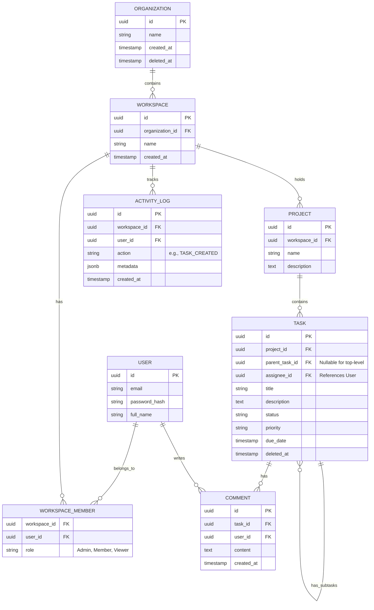

# STEP 3: DATABASE PLANNING

## 1. Database Strategy & Conventions
*   **Database Engine:** PostgreSQL 16+.
*   **Normalization:** 3rd Normal Form (3NF) for transactional data. Denormalization is only used in materialized views for heavy reporting.
*   **UUID Strategy:** **UUIDv7**. UUIDv7 is time-sortable, which prevents massive index fragmentation (a common issue with UUIDv4) while remaining globally unique and obscuring IDs from end-users.
*   **Soft Delete Strategy:** A `deleted_at` (TIMESTAMP) column is added to all major entities. Rows are never actually deleted, allowing for an "Undo" feature or Trash bin. Indexes must include `WHERE deleted_at IS NULL`.
*   **Audit Strategy:** Use a PostgreSQL Trigger that listens for INSERT/UPDATE/DELETE on critical tables and writes the old/new row JSONB data to a centralized `audit_logs` table.
*   **Activity Log Strategy:** A separate `activity_logs` table stores human-readable actions (e.g., "User X moved Task Y to Done") for the frontend activity feeds.

## 2. Core Entities & Relationships

*   **Organization:** The top-level billing entity. (1-to-Many Workspaces)
*   **Workspace:** A siloed environment for a specific company or department. (1-to-Many Projects)
*   **User:** Platform users. (Many-to-Many Workspaces via WorkspaceMembers)
*   **Project:** A collection of tasks/boards. (1-to-Many Tasks)
*   **Task:** The core work item. (1-to-Many Subtasks [self-referencing], 1-to-Many Comments, 1-to-Many Attachments)
*   **CustomField:** Dynamic fields for tasks. (Many-to-Many Tasks via TaskCustomFieldValues)

## 3. Entity-Relationship (ER) Diagram

## 4. Keys, Indexes, and Constraints
*   **Primary Keys (PK):** UUIDv7 for all tables.
*   **Foreign Keys (FK):** Enforce referential integrity. e.g., `project_id` on `Task` references `id` on `Project` ON DELETE CASCADE (soft delete handled at ORM/application level).
*   **Constraints:**
    *   `UNIQUE (workspace_id, email)` on `WorkspaceMembers`.
    *   `CHECK (status IN ('TODO', 'IN_PROGRESS', 'DONE', 'CANCELLED'))` or reference a custom statuses table.
*   **Indexes:**
    *   BTREE indexes on all Foreign Keys (e.g., `workspace_id`, `project_id`).
    *   Composite indexes for common query patterns: `INDEX(workspace_id, created_at)`.
    *   GIN indexes on JSONB columns (e.g., custom fields, metadata).
    *   Partial Indexes for Soft Deletes: `CREATE INDEX idx_active_tasks ON tasks(project_id) WHERE deleted_at IS NULL;`

## 5. Database Optimization Strategy
1.  **Row-Level Security (RLS):** Apply RLS policies filtering by `workspace_id` to guarantee tenant isolation at the database kernel level.
2.  **Connection Pooling:** Use PgBouncer to manage the thousands of short-lived connections from the Node.js API.
3.  **Read Replicas:** Route heavy read queries (Reporting, Analytics) to read-only replicas to avoid blocking primary write operations.
4.  **Partitioning:** Time-series data like `activity_logs` and `audit_logs` will be partitioned by month to keep index sizes manageable and enable fast archiving.
