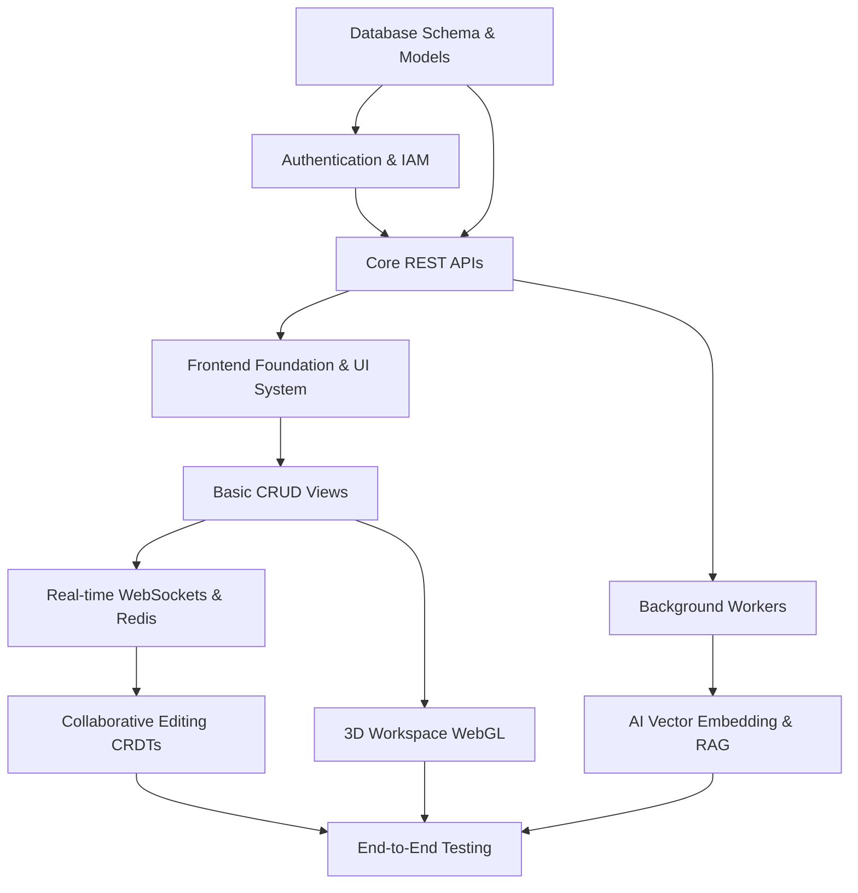

# STEP 14: DEPENDENCY GRAPH & FOLDER STRUCTURE

## 1. Development Order & Dependency Graph
Development must follow a strict dependency order to prevent blocked teams.



## 2. Monorepo Folder Structure
The project will be organized as a unified codebase with distinct frontend and backend directories.

```text
/
├── .github/
│   └── workflows/          # CI/CD pipelines
├── frontend/               # Next.js Application
│   ├── public/             # Static assets, 3D models (GLTF/OBJ)
│   ├── src/
│   │   ├── app/            # Next.js App Router (Pages & Layouts)
│   │   ├── components/
│   │   │   ├── ui/         # Base UI components (Buttons, Cards, Inputs)
│   │   │   ├── 3d/         # React Three Fiber components (Nodes, Canvas)
│   │   │   └── shared/     # Domain components (TaskRow, BoardColumn)
│   │   ├── store/          # Zustand global state slices
│   │   ├── hooks/          # React Query & custom hooks
│   │   ├── lib/            # API clients (Axios/Fetch), Zod schemas
│   │   └── styles/         # Vanilla CSS Modules, global tokens
│   ├── package.json
│   └── next.config.mjs
├── backend/                # Django & Channels Application
│   ├── core_project/       # Main Django settings, URLs, ASGI/WSGI entry
│   ├── apps/
│   │   ├── users/          # Auth, Profiles, JWT
│   │   ├── workspaces/     # Tenants, Roles, Permissions
│   │   ├── tasks/          # Projects, Tasks, Comments, Subtasks
│   │   └── realtime/       # Consumers, WebSocket routing
│   ├── requirements.txt
│   ├── Dockerfile
│   └── manage.py
├── docker-compose.yml      # Local dev environment
└── README.md               # Developer setup guide
```

## 3. Package List

### Frontend (Node.js / Next.js)
*   **Core:** `next@latest`, `react`, `react-dom`
*   **State & Data:** `zustand` (global), `@tanstack/react-query` (server state), `axios` (networking)
*   **Forms & Validation:** `react-hook-form`, `zod`, `@hookform/resolvers`
*   **3D & Animation:** `three`, `@react-three/fiber`, `@react-three/drei`, `framer-motion`
*   **Realtime & Docs:** `yjs`, `y-websocket` (CRDTs), `socket.io-client` (or native WebSocket API)
*   **UI:** `lucide-react` (icons), `clsx`, `tailwind-merge` (if utility classes are needed internally)

### Backend (Python / Django)
*   **Core & API:** `Django`, `djangorestframework`
*   **Auth:** `djangorestframework-simplejwt`, `django-cors-headers`
*   **Realtime:** `channels`, `channels_redis`
*   **Data & Background:** `psycopg2-binary` (PostgreSQL), `celery`, `redis`
*   **AI:** `openai`, `pinecone-client` (or `langchain` for orchestration)
*   **Docs & Utils:** `drf-spectacular` (Swagger/OpenAPI), `django-filter`

## 4. Installation & Setup Order (Execution)
1. **Infrastructure:** Run `docker-compose up -d` to spin up PostgreSQL and Redis.
2. **Backend Setup:** `cd backend`, create `venv`, `pip install -r requirements.txt`, run `python manage.py migrate`, start ASGI server.
3. **Frontend Setup:** `cd frontend`, `npm install`, `npm run dev`.
4. **Seed Data:** Run custom management command `python manage.py seed_db` to populate test workspaces, users, and tasks.
