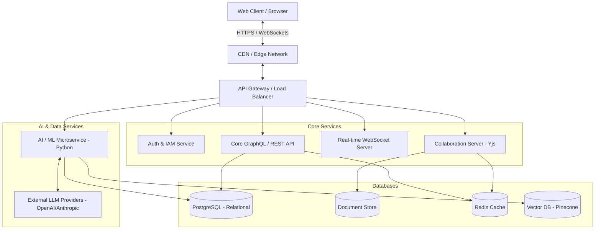

# Enterprise AI-Powered Project Management SaaS - System Architecture

## 1. Executive Summary
This document outlines the system architecture, design principles, and technical strategy for an enterprise-grade, AI-powered project management platform. Inspired by industry leaders (Jira, Notion, Monday.com, ClickUp, Asana, and Trello), the platform aims to provide a unified workspace combining highly flexible work management, block-based documentation, and deeply integrated AI capabilities to automate workflows, predict risks, and enhance productivity.

## 2. Core Product Capabilities

### 2.1 Work Management (The "Jira/ClickUp/Monday" Engine)
*   **Flexible Hierarchy:** Workspace > Space/Folder > Project/Board > Task > Subtask.
*   **Multi-View Architecture:** A single dataset power multiple views: List, Kanban Board, Gantt Chart, Calendar, Timeline, and Workload.
*   **Custom Fields & Workflows:** User-defined states, transitions, and field types (status, assignees, dates, formulas, relations).
*   **Automations:** "If THIS then THAT" rule builder (e.g., when status changes to 'Done', reassign to QA).

### 2.2 Knowledge & Docs (The "Notion" Engine)
*   **Block-based Editor:** Rich text documents composed of nested blocks (paragraphs, headers, tables, code, embeds).
*   **Real-time Collaboration:** Multiplayer editing with presence cursors and conflict resolution (OT/CRDT).
*   **Bi-directional Linking:** Connecting tasks to docs and docs to tasks seamlessly.

### 2.3 AI & Automation (The "Copilot" Engine)
*   **AI Assistant:** Context-aware chat sidebar for querying project status, summarizing long threads, and finding information across tasks and docs (RAG).
*   **Generative Workflows:** "Generate a project plan for X", auto-writing PRDs, creating subtasks from a description.
*   **Predictive Analytics:** AI monitoring sprint velocity, identifying bottlenecks, and predicting task delays based on historical data.
*   **Smart Triage:** Auto-categorization of incoming tickets/bugs, smart assignee suggestions.

## 3. Technical Stack Recommendation

### 3.1 Frontend (Web Application)
*   **Framework:** Next.js (App Router) for hybrid SSR/SSG and optimal SEO/performance.
*   **Language:** TypeScript for enterprise-grade type safety.
*   **Styling:** Vanilla CSS (CSS Modules) for maximum flexibility, control, and premium aesthetic design, avoiding generic utility bloat unless explicitly requested.
*   **State Management:** Zustand (global state) + React Query (server state & caching) + Yjs (for real-time CRDT sync).
*   **UI Components:** Custom-built accessible design system (Radix UI primitives under the hood if needed) for a premium, highly animated, glassmorphic aesthetic.

### 3.2 Backend Services
*   **Architecture:** Modular Monolith transitioning to Microservices as scale demands.
*   **Primary API:** Node.js / NestJS (TypeScript) or Go for high-performance concurrency.
*   **API Protocol:** GraphQL for flexible frontend data querying, REST for external integrations.
*   **Real-time:** WebSockets / Socket.io for live updates (task changes, presence, chat).
*   **AI/Python Service:** Python FastAPI microservice dedicated to ML model inference, orchestrating LLM calls, and heavy data processing.

### 3.3 Data Layer
*   **Primary Database (Relational):** PostgreSQL. Handles Workspaces, Users, Permissions, Projects, Tasks, and structural metadata.
*   **Document Database (NoSQL):** MongoDB or DynamoDB. Handles the block-based document data (highly nested, schema-less blocks).
*   **Vector Database:** Pinecone, Qdrant, or Milvus. Stores vector embeddings of tasks and documents for AI semantic search and RAG operations.
*   **Cache & Pub/Sub:** Redis. Used for session management, rate limiting, and real-time event broadcasting (Pub/Sub for WebSockets).

## 4. High-Level System Architecture

## 5. Security & Compliance
*   **Authentication:** OAuth2.0 / OIDC with SSO capabilities (Okta, Azure AD, Google) via NextAuth or Clerk/Auth0.
*   **Authorization:** Fine-grained Role-Based Access Control (RBAC) and Attribute-Based Access Control (ABAC) down to the field level.
*   **Data Protection:** Data encrypted at rest (AES-256) and in transit (TLS 1.3). Tenant-level logical isolation (Row-Level Security in Postgres).
*   **Audit Logging:** Immutable audit trails for all critical actions (who, what, when).

## 6. Development Phases

*   **Phase 1: Foundation & Core Work Management (Weeks 1-4)**
    *   System setup, CI/CD pipelines, Auth, and DB schemas.
    *   Workspace & Project creation.
    *   Basic Task CRUD, List View, and Board View.
*   **Phase 2: Docs & Real-time Collab (Weeks 5-8)**
    *   Block editor implementation.
    *   WebSocket integration for real-time multiplayer editing.
    *   Linking docs and tasks.
*   **Phase 3: AI Engine Integration (Weeks 9-12)**
    *   Data ingestion pipeline into Vector DB.
    *   AI Chat assistant (RAG).
    *   Generative AI features (auto-summarize, auto-generate tasks).
*   **Phase 4: Enterprise Polish & Scaling (Weeks 13-16)**
    *   Advanced views (Gantt, Timeline).
    *   Complex Automations engine.
    *   Performance optimization, load testing, and security audits.
